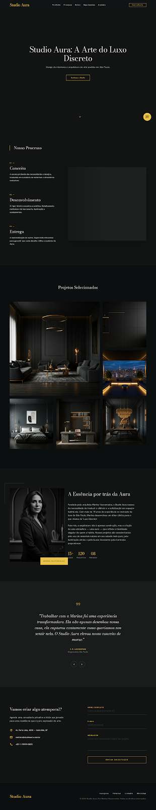

# Studio Aura

Landing page premium para um escritório de arquitetura e design de interiores de alto padrão.

O projeto foi desenvolvido com foco em experiência visual, sofisticação e conversão de leads, utilizando o conceito de **Quiet Luxury (Luxo Discreto)** através de uma identidade visual minimalista, tipografia editorial e elementos interativos.

## Preview



## Funcionalidades

- Hero section com vídeo de fundo
- Navegação responsiva
- Seção de metodologia em 3 etapas
- Galeria dinâmica de projetos
- Apresentação institucional da marca
- Slider de depoimentos
- Formulário de contato com validação
- Integração com WhatsApp
- Animações de scroll com GSAP e ScrollTrigger

## Tecnologias Utilizadas

- HTML5
- CSS3
- JavaScript (Vanilla JS)
- GSAP
- ScrollTrigger

## Estrutura do Projeto

```text
StudioAura/
├── src/
│   ├── assets/
│   ├── css/
│   └── js/
├── index.html
├── styles.css
├── script.js
├── DESIGN.md
└── README.md
```

## Como Executar

1. Clone o repositório:

```bash
git clone https://github.com/JonasEstevess/StudioAura.git
```

2. Acesse a pasta:

```bash
cd StudioAura
```

3. Abra o arquivo `index.html` no navegador.

Ou utilize uma extensão como **Live Server** no VS Code para melhor experiência de desenvolvimento.

## Objetivo

Criar uma experiência digital alinhada ao posicionamento de um escritório de arquitetura de luxo, priorizando:

- Elegância visual
- Performance
- Responsividade
- Experiência do usuário
- Conversão de contatos qualificados

## Autor

**Jonas Esteves**

GitHub: https://github.com/JonasEstevess
